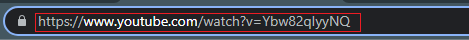

# download-thumbnail-youtube project

Feito Com **HTML**,**CSS** e **JAVASCRIPT**

**HTML:**
```html
     <br><br>
    <form>
        <input type="text" id="imageminput">
    </form><br>
    <button onclick="showimage()" class="btn">Image Download</button><br><br><br>
    
```
**CSS:**
```css
*{
    background-color: black;
    color: white;
    font-family: Arial, Helvetica, sans-serif;
    font-size: 20px;
}

#imageminput {
    border: 4px solid red;
    height: 40px;
    width: 400px;
    transition: 600ms;
}

#imageminput:hover {
    border: 4px solid green;
    color: green;
}

#imagemresultado {
    display: inline-block;
    border: 4px solid white;
    height: 200px;
    width: 400px;
    font-size: 40px;
    transition: 1s;
}

#imagemresultado:hover {
    border: 4px solid blue;
    color: blue;
}

.btn {
    display: inline-block;
    border: 4px solid white;
    height: 50px;
    width: 200px;
    transition: 500ms;
}

.btn:hover {
    border: 4px solid green;
    color: green;
}

.btn:active {
    border: 4px solid blue;
    c
```
**JAVASCRIPT:**
```js
  function showimage() {
    let imageurl = document.getElementById('imageminput').value
 
    let code = imageurl.charAt(32)
    code += imageurl.charAt(33)
    code += imageurl.charAt(34)
    code += imageurl.charAt(35)
    code += imageurl.charAt(36)
    code += imageurl.charAt(37)
    code += imageurl.charAt(38)
    code += imageurl.charAt(39)
    code += imageurl.charAt(40)
    code += imageurl.charAt(41)
    code += imageurl.charAt(42)

    console.log(code)
    document.getElementById('imagemresultado').src='https://i.ytimg.com/vi/'+code+'/hq720.jpg?sqp=-oaymwEcCOgCEMoBSFXyq4qpAw4IARUAAIhCGAFwAcABBg==&rs=AOn4CLC9oGZ9IDEhgbZvIcft8NZn-lP76w';


    }
```
